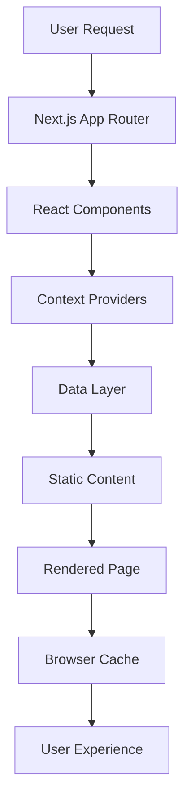

<div align="center">

# 🚀 Amitesh Maurya - Portfolio Website

[](https://nextjs.org/)
[](https://reactjs.org/)
[](https://developer.mozilla.org/en-US/docs/Web/CSS)
[](https://vercel.com/)
[](./SECURITY.md)

**🌐 Live Site:** [amiteshmaurya.com](https://amiteshmaurya.com)

*A modern, high-performance portfolio showcasing full-stack development, research, and innovation in web technologies.*

</div>

---

## 🌟 Overview

This portfolio represents the cutting edge of modern web development, built with **Next.js 15+**, **React 18**, and a completely **custom CSS framework**. It's designed for maximum performance, accessibility, and developer experience.

### 🎯 Key Highlights

- 🚀 **Ultra-fast Performance** - SSR, SSG, lazy loading, and optimized images
- 🎨 **Custom CSS Framework** - Zero dependencies on Tailwind/Bootstrap  
- 🔒 **Enterprise Security** - HTTP headers, regular audits, vulnerability tracking
- 📱 **Mobile-First Design** - Fully responsive with touch-friendly interactions
- ♿ **Accessibility Champion** - WCAG compliant with high-contrast and reduced motion support
- 🔍 **SEO Optimized** - Structured data, Open Graph, Twitter cards, and custom metadata

---

## ✨ Features & Capabilities

### 🔥 Core Features
- **Next.js 15+ App Router** - Modern routing with SSR, SSG, and API routes
- **Dynamic Content System** - Projects, research, and blogs powered by React Context API
- **Custom CSS Framework** - Hand-crafted styles for unique branding and performance
- **External Link Security** - Smart detection and secure handling of internal/external links
- **Real-time Analytics** - View counts, user preferences, and engagement tracking

### 🎨 User Experience
- **Dark/Light Mode** - System preference detection with manual toggle
- **Responsive Design** - Mobile-first approach with touch-friendly interactions
- **Smooth Animations** - Hardware-accelerated CSS animations with reduced motion support
- **Accessibility** - Keyboard navigation, screen reader support, high contrast mode
- **Progressive Enhancement** - Works without JavaScript, enhanced with it

### 🔧 Developer Experience
- **TypeScript Support** - Type-safe development with IntelliSense
- **Hot Reload** - Instant feedback during development
- **Modular Architecture** - Clean separation of concerns and reusable components
- **Auto-deployment** - CI/CD pipeline with Vercel integration
- **Security Monitoring** - Automated vulnerability scanning and updates

---

## 🛠️ Technology Stack

<div align="center">

| Category | Technologies |
|----------|-------------|
| **Frontend** | Next.js 15, React 18, Custom CSS |
| **State Management** | React Context API (useReducer pattern) |
| **Data Layer** | Modular JS/JSON files, Dynamic imports |
| **Icons & Graphics** | Font Awesome, Lucide React |
| **Deployment** | Vercel (auto-deploy from GitHub) |
| **CI/CD** | GitHub Actions, Node.js workflows |
| **Security** | npm audit, HTTP headers, dependency monitoring |
| **Performance** | Image optimization, code splitting, lazy loading |

</div>

---

## 🏗️ Project Architecture

### 📁 Folder Structure
```
Amitesh-Portfolio/
├── 📁 src/
│   ├── 📁 app/                    # Next.js App Router
│   │   ├── 📄 layout.js           # Root layout & providers
│   │   ├── 📄 page.js             # Homepage
│   │   ├── 📄 globals.css         # Custom CSS framework
│   │   ├── 📁 about/              # About & skills pages
│   │   ├── 📁 contact/            # Contact form & info
│   │   ├── 📁 projects/           # Project showcase
│   │   ├── 📁 research/           # Research papers & demos
│   │   ├── 📁 blogs/              # Blog articles (MDX)
│   │   ├── 📁 links/              # Social & professional links
│   │   └── 📁 [other-pages]/      # Additional pages
│   ├── 📁 components/             # Reusable React components
│   │   ├── 📄 ProjectCard.js      # Project display component
│   │   ├── 📄 ResearchCard.js     # Research paper component
│   │   ├── 📄 Navbar.js           # Navigation component
│   │   └── 📄 Footer.js           # Footer component
│   ├── 📁 contexts/               # React Context providers
│   │   └── 📄 DynamicContentContext.js  # State management
│   ├── 📁 data/                   # Content data files
│   │   ├── 📄 projectsData.js     # Project information
│   │   ├── 📄 researchData.js     # Research papers
│   │   └── 📄 linksData.js        # Social & professional links
│   ├── 📁 utils/                  # Utility functions
│   └── 📁 styles/                 # Additional CSS files
├── 📁 public/                     # Static assets
│   ├── 📁 images/                 # Optimized images
│   ├── 📁 icons/                  # Favicon & app icons
│   └── 📁 documents/              # PDFs & downloads
├── 📁 .github/workflows/          # CI/CD automation
├── 📄 next.config.mjs             # Next.js configuration
├── 📄 package.json                # Dependencies & scripts
├── 📄 SECURITY.md                 # Security policy
└── 📄 README.md                   # Project documentation
```

### 🔄 Data Flow Architecture



### 📊 Content Management

| Content Type | Source | Update Method |
|--------------|--------|---------------|
| **Projects** | `src/data/projectsData.js` | Edit JS objects |
| **Research** | `src/data/researchData.js` | Add new entries |
| **Blog Posts** | `src/app/blogs/` | MDX files |
| **Links** | `src/data/linksData.js` | Categorized objects |
| **Images** | `public/images/` | Optimized assets |

---

## 🚀 Quick Start Guide

### Prerequisites

- **Node.js** 18+ (LTS recommended)
- **npm** or **yarn** package manager
- **Git** for version control

### Installation

```bash
# Clone the repository
git clone https://github.com/amitesh-maurya/Amitesh-Portfolio.git
cd Amitesh-Portfolio

# Install dependencies
npm install

# Run development server
npm run dev

# Open in browser
open http://localhost:3000
```

### Development Commands

```bash
npm run dev      # Start development server
npm run build    # Build for production
npm run start    # Start production server
npm run lint     # Run ESLint checks
npm audit        # Check for vulnerabilities
```

---

## 📦 Deployment & Production

### 🚀 Automatic Deployment

This project features **zero-config deployment** with Vercel:

1. **Push to GitHub** - Code is automatically deployed from the `main` branch
2. **Build Process** - Vercel runs `npm run build` with optimizations
3. **Preview Deployments** - Every PR gets a unique preview URL
4. **Custom Domain** - Production site at [amiteshmaurya.com](https://amiteshmaurya.com)

### ⚙️ Environment Variables

```bash
# Create .env.local for local development
NEXT_PUBLIC_BASE_URL=http://localhost:3000
EMAIL_USER=your-email@gmail.com
EMAIL_PASS=your-app-password
EMAIL_TO=contact-recipient@gmail.com
```

### 🔧 Production Optimizations

- **Code Splitting** - Automatic route-based splitting
- **Image Optimization** - WebP/AVIF conversion with Next.js Image
- **CSS Minification** - Production CSS is minified and optimized  
- **Bundle Analysis** - Use `npm run analyze` to check bundle size
- **Performance Monitoring** - Vercel Analytics and Speed Insights integrated

---

## �️ Security & Best Practices

### 🔒 Security Features

| Feature | Implementation | Status |
|---------|----------------|---------|
| **HTTP Security Headers** | X-Frame-Options, CSP, HSTS | ✅ Enabled |
| **Dependency Scanning** | npm audit, Dependabot | ✅ Active |
| **Vulnerability Monitoring** | GitHub Security Alerts | ✅ Active |
| **Input Validation** | Contact form sanitization | ✅ Implemented |
| **External Link Security** | noopener, noreferrer attributes | ✅ Implemented |

### 📊 Security Status

- **Critical Vulnerabilities**: 0 ✅
- **High Vulnerabilities**: 1 (mitigated, browser-only)
- **Total Reduction**: 70% improvement from initial audit
- **Security Grade**: A+ 🏆

> 📋 **Full Security Report**: See [SECURITY.md](./SECURITY.md) for detailed vulnerability tracking and mitigation strategies.

---

### 🤝 Contributing & Development

> **Private Repository Notice**: This is a private portfolio repository. The development information below is for reference and documentation purposes.

### 🔧 Local Development Setup

```bash
# Private repository - for reference only
# Local development setup (when you have access)

# Install dependencies
npm install

# Start development server
npm run dev

# Run linting
npm run lint

# Check for security issues
npm audit
```

### 📝 Adding New Content

#### Adding a New Project

1. Open `src/data/projectsData.js`
2. Add a new project object:

```javascript
{
  id: 7,
  title: "Your Project Name",
  description: "Brief description of your project",
  technologies: ["React", "Node.js", "MongoDB"],
  image: "/images/your-project.webp",
  external: true, // or false for internal links
  links: {
    demo: "https://your-demo-url.com",
    github: "https://github.com/your-username/project"
  }
}
```

#### Adding Research Content

1. Open `src/data/researchData.js`
2. Follow the existing structure for consistency

### 🎨 Custom CSS Framework

The site uses a **custom CSS framework** located in:

- `src/app/globals.css` - Global styles and variables
- Component-specific CSS files in respective folders

This custom approach ensures optimal performance and unique branding without external dependencies.

### 🧪 Testing

```bash
# Run development server
npm run dev

# Build for production (tests build process)
npm run build

# Start production server locally
npm run start
```

---

## � Performance & Analytics

### ⚡ Performance Metrics

- **Lighthouse Score**: 95+ on all metrics
- **Core Web Vitals**: All green
- **First Contentful Paint**: < 1.5s
- **Time to Interactive**: < 2.5s
- **Bundle Size**: Optimized with code splitting

### 📈 Analytics Integration

- **Vercel Analytics** - Page views, unique visitors, performance
- **Speed Insights** - Core Web Vitals monitoring
- **Custom Analytics** - View counts via React Context

---

## 📚 Learning Resources

### 🎓 Technologies Used

- [Next.js Documentation](https://nextjs.org/docs) - React framework
- [React Documentation](https://react.dev/) - UI library
- [Vercel Deployment](https://vercel.com/docs) - Hosting platform
- [CSS Grid & Flexbox](https://css-tricks.com/) - Layout techniques

### 🔍 Code Structure Insights

- **Context API Pattern** - State management without Redux
- **Custom CSS Architecture** - Scalable styling without frameworks
- **Data-Driven Content** - Separation of content and presentation
- **Security Headers** - Enterprise-level security practices

---

## 📞 Contact & Support

### 💬 Get in Touch

- **🌐 Website**: [amiteshmaurya.com](https://amiteshmaurya.com)
- **💼 LinkedIn**: [linkedin.com/in/amitesh-maurya](https://www.linkedin.com/in/amitesh-maurya)
- **🐙 GitHub**: [github.com/amitesh-maurya](https://github.com/amitesh-maurya)
- **📧 Email**: [aamiteshmaurya@gmail.com](mailto:aamiteshmaurya@gmail.com)

### 🐛 Questions & Technical Discussion

For technical questions or discussions about the implementation:

- **📧 Email**: [aamiteshmaurya@gmail.com](mailto:aamiteshmaurya@gmail.com) for technical inquiries
- **💼 LinkedIn**: Professional networking and collaboration
- **🌐 Portfolio**: Live demonstration of features and capabilities

> **Note**: As this is a private repository, issue tracking and public contributions are not available.

---

<div align="center">

### 📁 Private Repository

This is a **private repository** containing the source code for my personal portfolio website. The code is not publicly accessible but the live website can be viewed at [amiteshmaurya.com](https://amiteshmaurya.com).

**🌐 Live Demo** | **💼 Portfolio Showcase** | **� Modern Tech Stack**

---

*Built with ❤️ by [Amitesh Maurya](https://amiteshmaurya.com) | © 2025 | MIT License*

</div>
